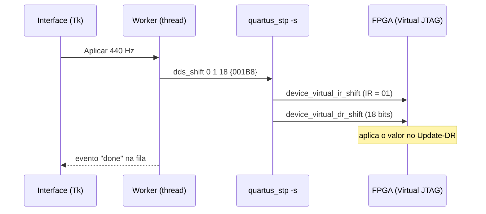

# Interface: controle do DDS pelo PC

[← Voltar ao início](../README.md) · [Parte digital](../fpga/README.md) · [Parte analógica](../analog/README.md) · [Roda de fase (jogo)](https://nseic.github.io/dds_waveform_generator/jogo/)

Interface em Python para controlar o gerador DDS pelo IP **Virtual JTAG** (`sld_virtual_jtag`),
usando o `quartus_stp` do Quartus como ponte para o USB-Blaster. Não precisa de nenhum
hardware além do cabo de gravação da placa.

- Frequência de 0 a 262 143 Hz, com a FTW esperada calculada na hora
- Forma de onda: seno, rampa, sinc ou arbitrária
- LUT arbitrária a partir de um `.mif` do Quartus, de um texto/CSV com 1024 valores ou de formas
  prontas (seno, quadrada, dente de serra, triangular), com gráfico e envio com barra de progresso
- Console com o log do `quartus_stp` e um prompt Tcl para depurar
- Tema escuro ou claro, nas cores do projeto

> [!NOTE]
> O lado do PC está pronto. No FPGA, o Virtual JTAG já está instanciado, mas o bloco de
> registradores que aplica o DR ainda falta ([estado da parte digital](../fpga/README.md#estado-atual)).

## Começo rápido

```bash
cd GUI
~/.local/bin/uv venv --python 3.12 .venv   # só na primeira vez
./run.sh
```

1. Grave o `.sof` do DDS (com o Virtual JTAG) na placa, com a chave RUN/PROG em **RUN**.
2. Feche o Programmer e o Signal Tap: eles disputam o cabo com a GUI.
3. `./run.sh` → **Conectar** (Device 1 = o FPGA na cadeia, Instance 0).
4. Frequência → **Aplicar**; forma de onda → clique na opção.
5. LUT arbitrária: **Abrir arquivo...** (`.mif` do Quartus, ou texto/CSV com 1024 valores de
   0 a 255) ou **Gerar**, e então **Enviar ao FPGA**. O ECG de 120 bpm do projeto está em
   [`fpga/lut/ecg_1024x8.mif`](../fpga/lut/ecg_1024x8.mif).

Só usa a biblioteca padrão do Python (3.12, com tkinter). O Quartus é localizado
automaticamente em `~/intelFPGA_lite/18.1/quartus` ou pela variável `QUARTUS_ROOTDIR`.

## Arquivos

| Arquivo | Conteúdo |
|---|---|
| `dds_jtag/` | Biblioteca: `DdsJtag`, `list_cables`, `load_lut`, `generate_lut`, `tuning_word`, ... |
| `gui.py`, `run.sh` | Interface gráfica (Tkinter) e o script que a abre com o Python do `.venv` |
| `theme.py` | Identidade visual da interface: cores do logo, fontes e estilos ttk |
| `exemplo.py` | Uso da biblioteca em script, sem a GUI |
| `udev/51-usbblaster.rules` | Permissão de acesso ao USB-Blaster no Linux |

## Protocolo

Virtual JTAG com **IR de 2 bits** e **DR de 18 bits** (LSB enviado primeiro), instance index 0:

| IR   | Instrução            | Conteúdo do DR                                       |
|------|----------------------|------------------------------------------------------|
| `00` | nenhuma              | —                                                    |
| `01` | frequência           | f em Hz, 0 a 262 143                                 |
| `10` | forma de onda        | bits 1..0: `00` seno, `01` rampa, `10` sinc, `11` arbitrária |
| `11` | escrita na LUT       | `endereço(9..0) & dado(7..0)`                        |

O valor só deve ser aplicado no **Update-DR**. Cada envio trava o JTAG (`device_lock`), faz um
`device_virtual_ir_shift`, um `device_virtual_dr_shift` por valor, e destrava. A LUT inteira
são 1024 deslocamentos, em blocos de 64.



A interface nunca fala direto com o cabo: um *worker* em outra thread mantém um
`quartus_stp -s` aberto e executa os pedidos em ordem, e a interface só lê a fila de eventos.
Assim a janela não trava durante o envio da LUT.

A GUI também mostra a FTW esperada, calculada como no `frequency_translator`:
`M = (f × 7 205 759 404) >> 24`, com f<sub>clk</sub> = 10 MHz. Se mudar o clock ou o protocolo no
VHDL, ajuste as constantes no topo de `dds_jtag/__init__.py`.

## Uso em script

```python
from dds_jtag import WAVEFORMS, DdsJtag, generate_lut, output_frequency, tuning_word

with DdsJtag() as dds:  # único cabo, device 1, instance 0
    dds.set_waveform(WAVEFORMS["Seno"])
    dds.set_frequency(440)
    m = tuning_word(440)
    print(f"440 Hz -> M = {m}, f real = {output_frequency(m):.4f} Hz")

    dds.write_lut(generate_lut("Quadrada"))
    dds.set_waveform(WAVEFORMS["Arbitrária"])
```

O exemplo completo está em [`exemplo.py`](exemplo.py) (`.venv/bin/python exemplo.py`).

## Aparência

A interface segue a identidade visual do projeto ([`docs/logo/`](../docs/logo/)): barra de
ferramentas com os grupos *Conexão JTAG* e *LUT arbitrária*, painel de propriedades (frequência,
FTW, forma de onda e parâmetros do sistema), gráfico da LUT arbitrária, console com log e prompt
Tcl, e barra de status com o estado da conexão e o progresso do envio da LUT. Os painéis são
redimensionáveis pelas divisórias.

Tema escuro (padrão) ou claro em **Exibir → Tema**. Para a tipografia da marca, instale as
fontes **Space Grotesk** e **JetBrains Mono** (Google Fonts); sem elas, a interface usa as
fontes do sistema. As cores ficam em `PALETTES`, no topo de `theme.py`.

## Permissão do USB-Blaster (uma vez só, precisa de sudo)

```bash
sudo cp udev/51-usbblaster.rules /etc/udev/rules.d/
sudo udevadm control --reload-rules && sudo udevadm trigger
```

Depois reconecte o cabo e encerre o `jtagd` antigo (`killall jtagd`). O `jtagconfig` deve
listar os dispositivos da cadeia, sem "Insufficient port permissions".

## Problemas comuns

| Sintoma | O que fazer |
|---|---|
| "Insufficient port permissions" no `jtagconfig` | Instale a regra do udev (acima) e reconecte o cabo |
| "Server error" depois de desconectar o cabo | Reinicie o servidor: `killall jtagd` |
| A GUI não conecta com o Programmer aberto | Feche o Programmer e o Signal Tap: só um programa usa o cabo por vez |
| Quartus não encontrado | Defina `QUARTUS_ROOTDIR` apontando para a pasta `quartus` da instalação |

O campo **Tcl** executa qualquer comando no `quartus_stp` aberto, o que ajuda a depurar
(ex.: `get_device_names -hardware_name {USB-Blaster [1-1.1]}`).
