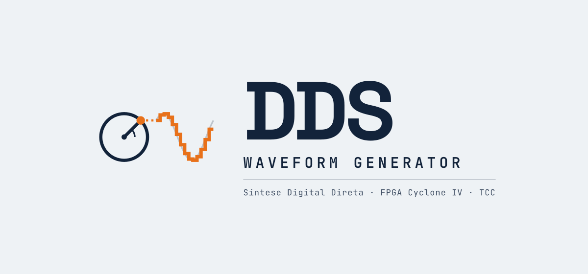
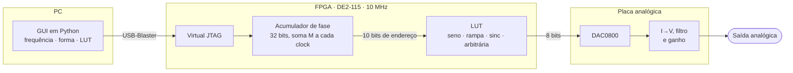

  <picture>
    <source media="(prefers-color-scheme: dark)" srcset="docs/logo/logo-dark.svg">
    
  </picture>

  
  
  
  
  

  Trabalho de Conclusão de Curso: gerador de sinais por <b>Síntese Digital Direta (DDS)</b> em VHDL na 
  <b>Terasic DE2-115</b>, com DAC de 8 bits numa placa analógica própria e controle pelo PC via <b>Virtual JTAG</b>.

  

  <b><a href="https://nseic.github.io/dds_waveform_generator/jogo/">▶ Abrir a roda de fase</a></b>: ajuste o M, gire o acumulador e tente o desafio <i>descubra o M</i>. 
  Sem internet? Abra <code>docs/jogo/index.html</code> no navegador.

## Menu

<table>
  <tr>
    <td width="25%" align="center" valign="top">
      <a href="fpga/README.md"> <b>Parte digital</b></a> 
      VHDL no Cyclone IV: acumulador de fase de 32 bits, LUTs, PLL de 10 MHz, Virtual JTAG e simulação no GHDL
    </td>
    <td width="25%" align="center" valign="top">
      <a href="analog/README.md"> <b>Parte analógica</b></a> 
      DAC0800, conversor I→V, filtro de reconstrução e ganho; placa no Altium e simulação no LTspice
    </td>
    <td width="25%" align="center" valign="top">
      <a href="GUI/README.md"> <b>Interface</b></a> 
      GUI em Python: frequência, forma de onda e LUT arbitrária pelo USB-Blaster
    </td>
    <td width="25%" align="center" valign="top">
      <a href="https://nseic.github.io/dds_waveform_generator/jogo/"> <b>Roda de fase</b></a> 
      O acumulador em câmera lenta, com aliasing, truncamento de fase e um desafio
    </td>
  </tr>
</table>

## Como funciona

A cada clock o acumulador soma a palavra de sintonia M ao registrador de fase. O estouro do
registrador de 32 bits fecha uma volta, ou seja, um período do sinal. Os 10 bits mais
significativos da fase endereçam a LUT, que devolve a amostra de 8 bits para o DAC. Na placa
analógica, a corrente do DAC vira tensão e o filtro de reconstrução suaviza os degraus.

$$
f_{out} = \frac{M \cdot f_{clk}}{2^{32}}
\qquad\Rightarrow\qquad
1\ \text{kHz}:\ M = 429\,496,\ \ f_{out} = 999{,}9983\ \text{Hz}
$$

| O projeto em números | |
|---|---|
| Clock do DDS | 10 MHz (PLL a partir dos 50 MHz da placa) |
| Acumulador de fase | 32 bits, resolução Δf = fclk / 2³² ≈ 2,33 mHz |
| LUT | 1024 amostras × 8 bits, quatro formas (seno, rampa, sinc, arbitrária) |
| Frequência pedida pelo PC | 0 a 262 143 Hz, inteiro de 18 bits |
| DAC | DAC0800 de 8 bits, IREF = 2 mA |
| Filtro de reconstrução | Sallen-Key de 2ª ordem, f0 ≈ 1 MHz |

## Na bancada

<table>
  <tr>
    <td width="50%"></td>
    <td width="50%"></td>
  </tr>
  <tr>
    <td align="center">DE2-115, placa analógica, fontes de ±15 V e +10 V e osciloscópio</td>
    <td align="center">Primeira medida (3 set. 2026): seno de 100,0 Hz, 5,08 V pico a pico</td>
  </tr>
</table>

## Começando

1. **FPGA**: abra `fpga/DDS.qpf` no Quartus 18.1, compile e grave o `.sof` pelo Programmer
   (chave RUN/PROG em **RUN**). Detalhes em [fpga/README.md](fpga/README.md#compilar-e-gravar).
2. **Placa**: ligue o barramento de 8 bits do GPIO no J1 e alimente com ±15 V e +10 V
   ([analog/README.md](analog/README.md#alimentação-e-conectores)).
3. **PC**: feche o Programmer e abra a interface pelo atalho *DDS Waveform Generator* (criado por
   `GUI/build_exe.sh` e `GUI/install_launcher.sh`) ou com `cd GUI && ./run.sh`. Conecte, escolha a
   frequência e a forma de onda. Para a arbitrária, abra `fpga/lut/ecg_1024x8.mif` e clique em *Enviar ao FPGA*
   ([GUI/README.md](GUI/README.md)).

<b>Simular sem a placa</b>

 

- **VHDL (GHDL):** `fpga/testbenches/run_all.sh` roda os 16 testbenches, de cada bloco até o
  top-level com o PLL, e `gerar_figuras.py` desenha as figuras de cada um
  ([detalhes](fpga/README.md#testbenches)).
- **Analógico (LTspice):** `analog/simulation/TCC.asc` simula o front-end com os códigos de um seno
  de 1 kHz vindos da simulação do VHDL ([detalhes](analog/README.md#simulação-no-ltspice)).
- **No navegador:** a [roda de fase](https://nseic.github.io/dds_waveform_generator/jogo/) mostra o
  acumulador, a LUT e o filtro em escala reduzida.

<b>Estrutura do repositório</b>

 

| Pasta | Conteúdo |
|---|---|
| [`fpga/`](fpga/) | Projeto Quartus: fontes VHDL, IPs, tabelas `.mif`, testbenches e as figuras deles |
| [`analog/`](analog/) | Placa no Altium (`layout/`), simulação no LTspice (`simulation/`) e fotos (`figuras/`) |
| [`GUI/`](GUI/) | Interface em Python e a biblioteca `dds_jtag` |
| [`docs/`](docs/) | Logo, figuras, a roda de fase (`jogo/`) e o script que gera as figuras |
| [`overleaf/`](overleaf/) | Texto do TCC em LaTeX, no modelo da COELE-CM (UTFPR Campo Mourão) do prof. Osmar Tormena Júnior |

## Estado do projeto

- [x] Núcleo DDS em VHDL (acumulador de fase, PLL, quatro LUTs, saída registrada)
- [x] Controle pelo Virtual JTAG no FPGA, ligando a GUI ao DDS
- [x] Pinagem do DAC e restrições de tempo, com timing fechado no Quartus
- [x] 16 testbenches no GHDL, do bloco ao top-level, com figuras para o texto
- [x] Interface em Python com o protocolo do Virtual JTAG
- [x] Placa analógica projetada, fabricada e medida na bancada
- [x] Simulação do front-end analógico no LTspice: seno de 1 kHz com THD de −70,9 dBc
- [x] Estágio de saída classe AB retirado (distorção); a saída é o seguidor de tensão
- [ ] Validação completa na placa: controle pela GUI, medidas de frequência e espectro

O detalhe de cada parte está nos READMEs do [FPGA](fpga/README.md#estado-atual), da
[placa analógica](analog/README.md) e da [interface](GUI/README.md).

<b>Identidade visual</b>

 

Os arquivos do logo ficam em [`docs/logo/`](docs/logo/), em SVG (vetorial, texto em
contornos) e PNG (2×). A interface em `GUI/` e a roda de fase usam as mesmas cores.

| Versão | SVG | PNG |
|---|---|---|
| Fundo claro | [`logo-light.svg`](docs/logo/logo-light.svg) | [`logo-light.png`](docs/logo/logo-light.png) |
| Fundo escuro | [`logo-dark.svg`](docs/logo/logo-dark.svg) | [`logo-dark.png`](docs/logo/logo-dark.png) |
| Ícone | [`icon.svg`](docs/logo/icon.svg) | [`icon.png`](docs/logo/icon.png) |

O símbolo representa o próprio DDS: a roda de fase (acumulador) projeta seu ponto numa
senoide em degraus, que é a saída quantizada da LUT.

| Cor | Claro | Escuro |
|---|---|---|
| Fundo | `#EEF2F5` | `#0B1626` |
| Texto | `#12233A` | `#E6EDF5` |
| Destaque | `#E8711A` | `#FF9A3D` |

Tipografia: Space Grotesk (títulos) e JetBrains Mono (dados e código).

As figuras da documentação (animação, LUTs e filtro) são geradas por
[`docs/gerar_figuras.py`](docs/gerar_figuras.py), que precisa de numpy e matplotlib.

## Referências

- Analog Devices. *MT-085: Fundamentals of Direct Digital Synthesis (DDS)*.
- Analog Devices. *A Technical Tutorial on Digital Signal Synthesis*, 1999.
- J. Tierney, C. Rader, B. Gold. "A Digital Frequency Synthesizer". *IEEE Transactions
  on Audio and Electroacoustics*, 19(1), 1971.
- P. E. McSharry, G. D. Clifford, L. Tarassenko, L. A. Smith. "A dynamical model for
  generating synthetic electrocardiogram signals". *IEEE Transactions on Biomedical
  Engineering*, 50(3), 2003.
- A. L. Goldberger et al. "PhysioBank, PhysioToolkit, and PhysioNet". *Circulation*,
  101(23), 2000. ECGSYN: <https://physionet.org/content/ecgsyn/>
- Texas Instruments. *DAC0800/DAC0802 8-Bit Digital-to-Analog Converters*, SNAS538C.
- Terasic. *DE2-115 User Manual*.
