# Parte analógica: do código de 8 bits à tensão

[← Voltar ao início](../README.md) · [Parte digital](../fpga/README.md) · [Interface (GUI)](../GUI/README.md) · [Roda de fase (jogo)](https://nseic.github.io/dds_waveform_generator/jogo/)

A placa analógica recebe o barramento de 8 bits do FPGA, pelo GPIO da DE2-115, e o transforma
em tensão. São cinco blocos: o DAC0800 (saída em corrente), um conversor corrente-tensão
diferencial, um filtro de reconstrução, um amplificador de ganho ajustável e o estágio de saída.
A placa foi desenhada no Altium Designer e o circuito foi simulado no LTspice.

<table>
  <tr>
    <td width="50%">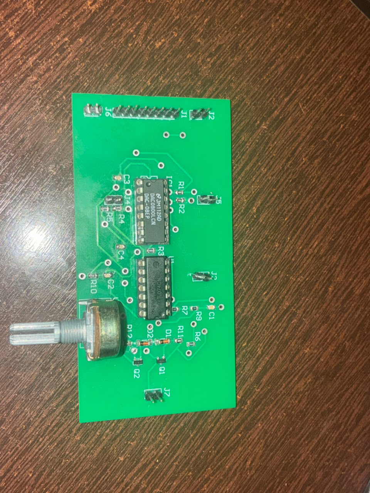</td>
    <td width="50%"></td>
  </tr>
  <tr>
    <td align="center"><sub>Placa montada: DAC0800 (IC1), TL074 (U1) e o potenciômetro de ganho (VR1)</sub></td>
    <td align="center"><sub>Medida de 3 set. 2026: seno de 100,0 Hz, 5,08 V pico a pico (Tektronix TDS2002B)</sub></td>
  </tr>
</table>

## Cadeia de sinal

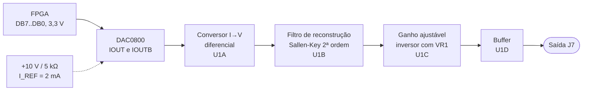

A ordem acima é a da placa (esquemático `OUTPUT_GEN.SchDoc`). Na simulação o ganho vem antes
do filtro e o potenciômetro é o resistor de entrada do inversor, em vez de ficar na
realimentação. Para sinais dentro da faixa linear, a ordem do filtro e do ganho não muda a
resposta.

## Blocos

Os valores abaixo são os da simulação (`simulation/TCC.asc`).

### 1. DAC0800: código → corrente

DAC multiplicador de 8 bits com saídas complementares em corrente. A referência de +10 V passa
por R8 = 5 kΩ, o que fixa a corrente de referência:

$$
I_{REF} = \frac{10\ \text{V}}{5\ \text{k}\Omega} = 2\ \text{mA} \qquad
I_{OUT} = I_{REF}\cdot\frac{\text{código}}{256} \qquad
I_{OUT} + \overline{I_{OUT}} = I_{FS} = I_{REF}\cdot\frac{255}{256} \approx 1{,}992\ \text{mA}
$$

- Com VLC = 0 V, o limiar lógico é 1,4 V: as entradas aceitam direto os 3,3 V (LVTTL) do GPIO.
- **B1 é o MSB e B8 o LSB.** Na placa, o conector J1 liga DB7 em B1 e DB0 em B8.
- Capacitor de compensação de 100 nF entre COMP e V−.

### 2. Conversor corrente-tensão diferencial

Um amplificador de diferenças com quatro resistores de 1 kΩ (R4 a R7) recebe as duas saídas
do DAC. Usar as duas dobra a excursão e deixa o sinal simétrico em torno de zero:

$$
V_{dif} = \left(I_{OUT} - \overline{I_{OUT}}\right)\cdot 1\ \text{k}\Omega
\quad\Rightarrow\quad -1{,}99\ \text{V (código 0)} \ \ \text{a} \ \ +1{,}99\ \text{V (código 255)}
$$

### 3. Filtro de reconstrução

Sallen-Key passa-baixas de ganho unitário com R11 = R12 = 48 Ω e C3 = C4 = 3,3 nF. Com
resistores e capacitores iguais, Q = 0,5: são dois polos reais na mesma frequência.

$$
f_0 = \frac{1}{2\pi R C} \approx 1{,}00\ \text{MHz} \qquad
f_{-3\,\text{dB}} = f_0\sqrt{\sqrt{2}-1} \approx 647\ \text{kHz}
$$

<picture>
  <source media="(prefers-color-scheme: dark)" srcset="../docs/img/filtro-dark.svg">
  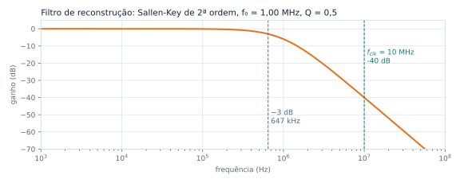
</picture>

O filtro tira os degraus da saída do DAC. As imagens do sinal aparecem em torno de
f<sub>clk</sub> = 10 MHz, onde a atenuação é de cerca de 40 dB. Na maior frequência que o
FPGA aceita (262 kHz), a perda dentro da banda é de 0,6 dB.

### 4. Ganho ajustável

Amplificador inversor com potenciômetro de 10 kΩ. Na simulação, R10 = 10 kΩ fica na
realimentação e o trecho 1–2 do potenciômetro é o resistor de entrada:

$$
G = -\frac{R_{10}}{R_{1\text{–}2}} = -\frac{10\ \text{k}\Omega}{10\ \text{k}\Omega\,(1 - \theta/180)}
\quad\Rightarrow\quad G = -1{,}2 \ \text{com}\ \theta = 30
$$

Na placa, VR1 fica na realimentação do U1C, e o ganho é proporcional à resistência de VR1.

### 5. Saída

O U1D é um seguidor de tensão que entrega o sinal à saída J7.

A placa foi desenhada com um par complementar BC847/BC857 depois do seguidor, polarizado por
dois diodos LL4148 (classe AB), para aumentar a corrente de saída. Esse estágio foi retirado por
distorção e resultados inesperados nos ensaios, e a saída passou a ser tomada do seguidor.

### Alimentação e conectores

| Conector | Sinal |
|---|---|
| J1 | Barramento de dados DB0 a DB7, vindo do GPIO da DE2-115 |
| J3, J4 | +15 V e −15 V (TL074 e DAC0800) |
| J5 | +10 V (referência do DAC) |
| J2, J6 | GND |
| J7 | Saída analógica |

## Simulação no LTspice

A pasta `simulation/` tem o front-end completo no LTspice 26, alimentado pelos códigos que a
[simulação do VHDL](../fpga/README.md#testbenches) produziu para um seno de 1 kHz.

| Arquivo | Conteúdo |
|---|---|
| `TCC.asc` | Esquemático: DAC0800, conversor I→V, ganho, filtro e buffer (`.tran 5m`), com os nós `DIFFERENTIAL`, `INVERTER`, `FILTERED` e `BUFFERED` |
| `TCC.net` | Netlist exportada pelo LTspice |
| `DAC0800.lib`, `DAC0800.asy` | Macromodelo comportamental do DAC0800, feito a partir do datasheet da TI (SNAS538C), e o símbolo |
| `SOURCES.lib`, `sources.asy` | Subcircuito `sources`: os 8 bits (PWL), ±15 V e +10 V |
| `FONTES.asc` | Esquemático das fontes que deu origem ao subcircuito `sources` |
| `pwl/` | PWL de cada bit, código por amostra e saída de um DAC ideal; detalhes em [`pwl/LEIAME.txt`](simulation/pwl/LEIAME.txt) |
| `resultados/` | Formas de onda (`WAVEFORMS.txt.gz`) e FFT (`WAVEFORMS_FFT.txt.gz`) exportadas do LTspice; as figuras do TCC saem delas |

<p align="center">
  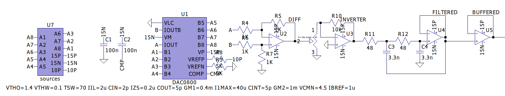
  <br><sub>Esquemático simulado: fontes dos estímulos (U7), DAC0800 (U1), conversor I→V (U2), ganho (U3), filtro (U4) e buffer (U5)</sub>
</p>

Estímulo: f = 1000 Hz no DDS (FTW = 429 496, ou 999,9983 Hz), 50 001 amostras a 10 MHz
(5 períodos), níveis de 0 e 3,3 V com bordas de 2 ns.

<details>
<summary><b>Como rodar</b></summary>

<br>

1. Instale os modelos na pasta de bibliotecas do LTspice (`%LOCALAPPDATA%\LTspice\lib`): os
   `.asy` em `sym/` e os `.lib` em `sub/`. Foi assim que a simulação foi rodada.
2. O esquemático usa um símbolo `POTENTIOMETER` que não vem com o LTspice e não está no
   repositório. O subcircuito é este:

   ```spice
   .SUBCKT POTENTIOMETER 1 2 3
   R1 1 2 {R-(Angle/180 * R)}
   R2 2 3 {Angle/180 * R}
   .ENDS POTENTIOMETER
   ```

3. O `SOURCES.lib` aponta para os PWL por caminho absoluto
   (`C:\users\nicholas\Desktop\TCC\pwl\bitN.txt`). Ajuste para o caminho de
   `analog/simulation/pwl/` na sua máquina.
4. Abra o `TCC.asc` e rode. Leva cerca de 1 min. O ponto de operação só sai por
   *pseudo-transient* (Newton direto e *Gmin stepping* falham), o que o LTspice faz sozinho.

No Linux o LTspice roda pelo Wine, e `ltspice -b TCC.net` roda em lote. Os resultados (`.raw`
de ~78 MB, `.fft`, `.log`) não vão para o Git.

</details>

### Resultados

Simulação de 5 ms (cinco períodos do seno de 1 kHz vindo do VHDL):

| Grandeza | Simulado | Calculado |
|---|---|---|
| Corrente de escala completa do DAC | 1,99 mA | 1,992 mA |
| Conversor I→V (`DIFFERENTIAL`) | −1,976 a +1,991 V | −1,977 a +1,992 V (códigos 1 a 255) |
| Código 128 no conversor | 7,81 mV | I<sub>REF</sub>/256 · 1 kΩ = 7,81 mV |
| Ganho do inversor (`INVERTER`) | −1,19999 | −1,2 |
| Saída (`FILTERED`, `BUFFERED`) | 4,760 V de pico a pico | 4,763 V de pico a pico |
| Frequência | 1,000 kHz | 999,998 Hz |
| Atraso do filtro | 321 ns | 1/(Q·ω₀) = 317 ns |

No espectro (FFT do LTspice, resolução de 200 Hz):

| Componente | Antes do filtro | Depois do filtro |
|---|---|---|
| Distorção harmônica total, 2ª a 10ª (quase só ímpares, da quantização em 8 bits) | −70,9 dBc | −70,9 dBc |
| Imagens da tabela em 1024·f ± f (1,023 e 1,025 MHz), o limite de 6,02·P | −60,5 dBc | −67,0 dBc |
| Imagens do clock em 10 MHz ± 1 kHz | −96 dBc | −119 dBc (perto do piso numérico) |

## Resultados em bancada

Medidas com o código final do FPGA (5 out. 2026), na saída da placa (antes do antigo estágio
classe AB) e na saída do subtrator, logo após o DAC. As telas, os pontos em CSV e a configuração
do osciloscópio de cada medida estão em [`resultados/`](resultados/README.md).

| Medida | Resultado |
|---|---|
| Frequência | 0,7 a 12 ppm acima da calculada pela FTW, um desvio comum às referências de tempo da placa e do osciloscópio |
| Seno de 10 Hz a 1 kHz na saída | THD de −43 a −50 dBc e SINAD de 34 a 37 dB, limitados pelo osciloscópio de 8 bits |
| Seno de 10 kHz na saída | distorção nos cruzamentos por zero, THD de −17,3 dBc |
| Seno de 10 kHz no subtrator | limpo, THD de −46,8 dBc: a distorção nasce depois do conversor I→V (em investigação) |
| Espectro até 50 MHz | nenhum espúrio acima de −45,6 dBc |
| Amplitude no subtrator | 2,1 V<sub>pp</sub>, cerca de metade dos 3,97 V<sub>pp</sub> calculados (conferir os componentes montados) |

<table>
  <tr>
    <td width="50%"></td>
    <td width="50%"></td>
  </tr>
  <tr>
    <td align="center"><sub>Saída da placa, 10 kHz: distorção nos cruzamentos por zero</sub></td>
    <td align="center"><sub>Saída do subtrator, 10 kHz: limpo</sub></td>
  </tr>
</table>

Antes dessas medidas, um teste com tabelas que alternam um bit de cada vez achou o bit 2 do
barramento aberto no cabo ([detalhes](resultados/README.md#teste-dos-pesos-dos-bits)).

## Placa (Altium Designer)

O projeto `layout/TCC.PrjPcb` tem dois documentos: o esquemático `OUTPUT_GEN.SchDoc` e a placa
`PCB1.PcbDoc`. As imagens abaixo são do projeto aberto no KiCad (importado do Altium).

<p align="center">
  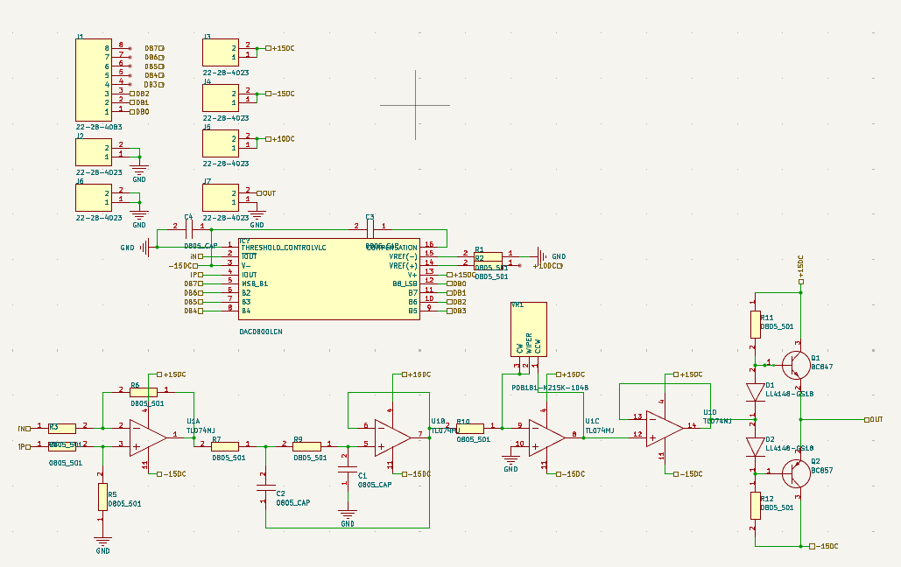
  <br><sub>Esquemático: conectores J1 a J7, DAC0800 (IC1), as quatro seções do TL074 (U1A a U1D) e VR1. O par Q1/Q2, com D1, D2, R11 e R12, é o estágio classe AB retirado da montagem.</sub>
</p>

<table>
  <tr>
    <td width="55%">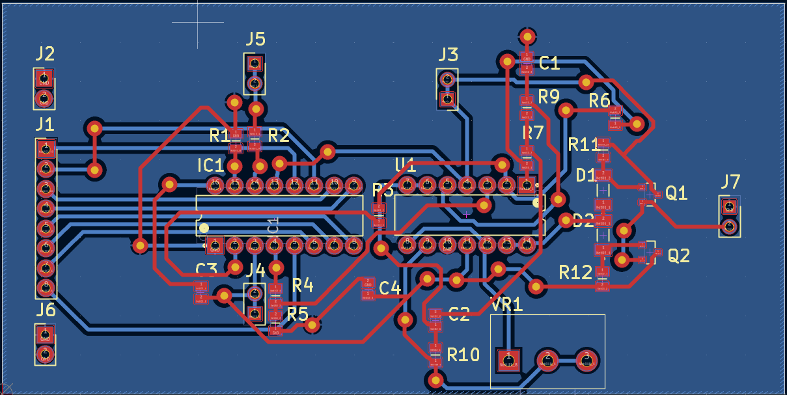</td>
    <td width="45%">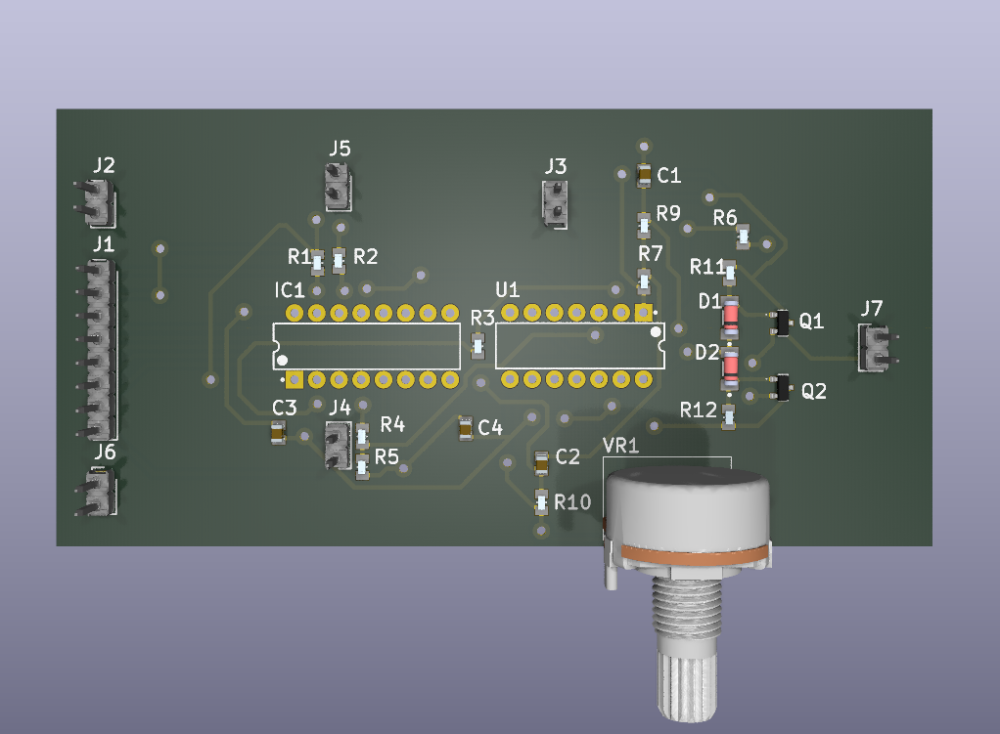</td>
  </tr>
  <tr>
    <td align="center"><sub>Layout: trilhas na face superior (vermelho) e na inferior (azul), com preenchimento de cobre</sub></td>
    <td align="center"><sub>Vista 3D da placa montada</sub></td>
  </tr>
</table>

| Arquivo | Conteúdo |
|---|---|
| `TCC.PrjPcb` | Projeto do Altium |
| `OUTPUT_GEN.SchDoc` | Esquemático da placa: DAC0800LCN, TL074, VR1, conectores e o par BC847/BC857, retirado da montagem |
| `PCB1.PcbDoc` | Layout da placa fabricada |
| `Project Outputs for TCC/` | Gerbers, furação e relatórios; o pacote para fabricação é `gerber.zip` (10 ago. 2026) |
| `TL074CPWRG4.IntLib` | Biblioteca integrada do TL074 |
| `esquematico.SchDoc`, `PCB.PcbDoc` | Versões anteriores, fora do projeto |
| `History/`, `__Previews/`, `Project Logs for TCC/` | Arquivos automáticos do Altium (backups locais, prévias e logs de ECO) |
| `TCC/` | Importação do projeto no KiCad (por enquanto, só o projeto e a biblioteca de símbolos) |

O projeto também usa a biblioteca `..\bibliotecas\BIBLIOTECA_GERAL.SchLib`, que fica fora do
repositório.

<details>
<summary><b>Fotos: esquemático, bancada e ligação com a DE2-115</b></summary>

<br>

<table>
  <tr>
    <td width="50%">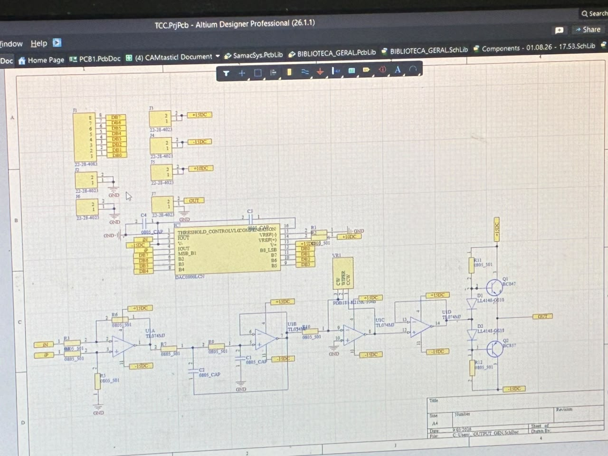</td>
    <td width="50%">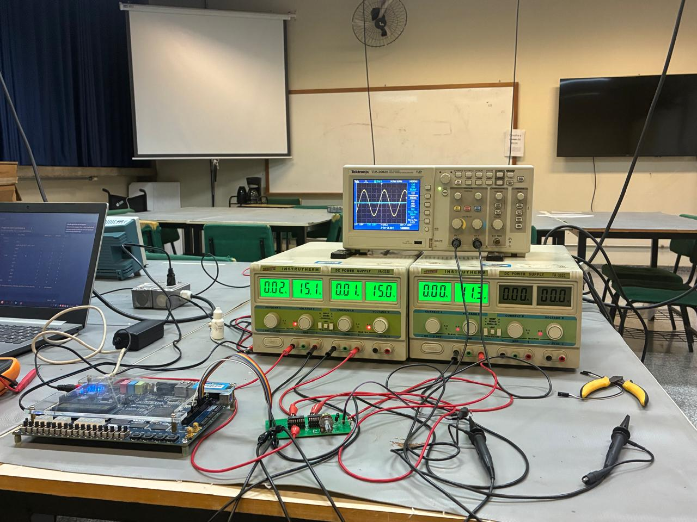</td>
  </tr>
  <tr>
    <td align="center"><sub>Esquemático <code>OUTPUT_GEN.SchDoc</code> no Altium</sub></td>
    <td align="center"><sub>Bancada: DE2-115, placa analógica, fontes de ±15 V e +10 V e osciloscópio</sub></td>
  </tr>
  <tr>
    <td>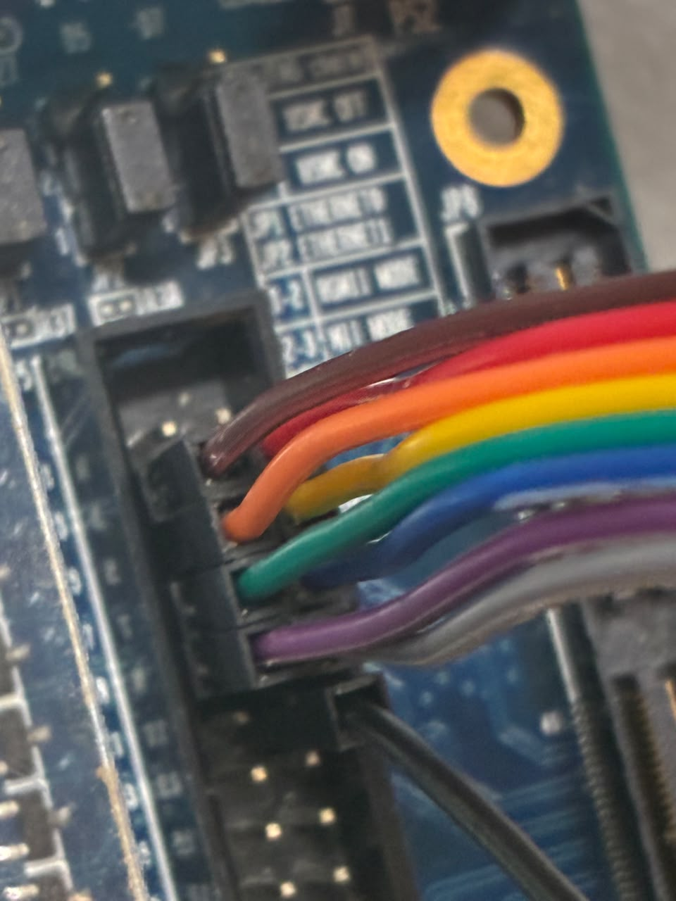</td>
    <td>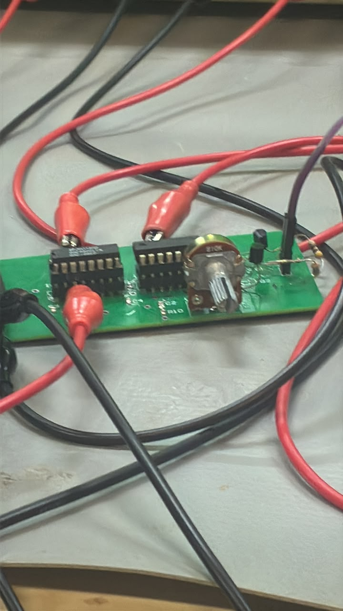</td>
  </tr>
  <tr>
    <td align="center"><sub>Barramento de 8 bits saindo do GPIO da DE2-115</sub></td>
    <td align="center"><sub>Placa em teste</sub></td>
  </tr>
</table>

</details>

## Referências

- Texas Instruments. *DAC0800/DAC0802 8-Bit Digital-to-Analog Converters*, SNAS538C, 2013.
- Texas Instruments. *TL07xx Low-Noise FET-Input Operational Amplifiers*.
- R. P. Sallen, E. L. Key. "A practical method of designing RC active filters". *IRE Transactions on
  Circuit Theory*, 2(1), 1955.
- Analog Devices. *MT-085: Fundamentals of Direct Digital Synthesis (DDS)*.
