# Resultados em bancada

[← Parte analógica](../README.md) · [← Início](../../README.md)

Capturas do osciloscópio dos ensaios da placa analógica com o código final do FPGA, feitos em
5 de outubro de 2026. A frequência e a forma de onda foram escolhidas pela [GUI](../../GUI/README.md).
Os mesmos dados estão no TCC, na seção "Ensaios em bancada" e no Apêndice C.

## Pontos de medida

| Pasta | Ponto da placa |
|---|---|
| [`AB/`](AB) | Saída do seguidor U1D, onde ficava o estágio classe AB (retirado). É hoje a saída da placa. VR1 ajustado para cerca de 0,67 V de pico a pico. |
| [`subtrator/`](subtrator) | Saída do amplificador de diferenças U1A, o conversor corrente-tensão logo após o DAC0800. |

**Condições:**
- **Osciloscópio:** Tektronix TBS1102B (100 MHz, 2 GS/s, 8 bits), em modo *sample* e com acoplamento AC. Cada captura tem 2500 pontos; as FFT têm 1024.
- **Placa:** sem o estágio classe AB, e com um capacitor em paralelo com R6 (realimentação do U1A), posto como teste para atenuar os picos de chaveamento do DAC.
- **Bit 2:** a linha do bit 2 do barramento, aberta no cabo junto ao JP5 (ver [Teste dos pesos dos bits](#teste-dos-pesos-dos-bits)), foi consertada antes destas medidas.
- **Data:** o relógio do osciloscópio estava um dia adiantado; as telas mostram 6 de outubro.

## Arquivos

Cada medida tem uma pasta com três arquivos de mesmo nome:

| Arquivo | Conteúdo |
|---|---|
| `<medida>.png` | Tela do osciloscópio (o BMP original convertido para PNG, sem perdas) |
| `<medida>.csv` | Pontos do canal 1. Metadados nas colunas 1 e 2; nas colunas 4 e 5, tempo (s) e tensão (V), ou frequência (Hz) e dB nas FFT |
| `<medida>.set` | Configuração do osciloscópio (pode ser recarregada nele) |

| Medida | O que é | Escala | Original no osciloscópio |
|---|---|---|---|
| `AB/seno_10Hz` | seno de 10 Hz | 100 mV/div, 25 ms/div | `F0000` |
| `AB/seno_100Hz` | seno de 100 Hz | 100 mV/div, 2,5 ms/div | `F0001` |
| `AB/seno_1kHz` | seno de 1 kHz | 100 mV/div, 500 µs/div | `F0002` |
| `AB/seno_10kHz` | seno de 10 kHz | 100 mV/div, 50 µs/div | `F0003` |
| `AB/rampa_100Hz` | rampa de 100 Hz | 100 mV/div, 2,5 ms/div | `F0004` |
| `AB/sinc_100Hz` | sinc de 100 Hz | 100 mV/div, 2,5 ms/div | `F0005` |
| `AB/ecg_100Hz` | forma arbitrária com o ECG, 100 Hz (dois batimentos por período) | 100 mV/div, 2,5 ms/div | `F0006` (`ecg@100Hz`) |
| `AB/fft_pico_harmonico` | FFT do seno de 100 Hz, até 2,5 kHz | 10 dB/div, 250 Hz/div | `F0007` (`FFT@pico_harmonico`) |
| `AB/fft_aliasing` | FFT do seno de 100 Hz, até 50 MHz | 10 dB/div, 5 MHz/div | `F0008` (`FFT@aliasing`) |
| `AB/fft_10kHz_subamostrado` | FFT do seno de 10 kHz amostrado a 2,5 kS/s | 10 dB/div, 125 Hz/div | `F0000` (`ALL0000`) |
| `subtrator/seno_10kHz` | seno de 10 kHz | 500 mV/div, 50 µs/div | `F0001` (`ALL0001`) |
| `subtrator/seno_20kHz` | seno de 20 kHz | 500 mV/div, 25 µs/div | `F0002` (`ALL0002`) |
| `subtrator/seno_30kHz` | seno de 30 kHz | 500 mV/div, 25 µs/div | `F0003` (`ALL0003`) |

<b>Recuperação das capturas</b>

 

O pendrive com as capturas foi retirado durante uma gravação e ficou com a FAT corrompida. Sete
pastas ficaram ilegíveis: `ecg@100Hz`, `FFT@aliasing`, `FFT@pico_harmonico`, `ALL0000` e
`ALL0001` a `ALL0003`.

O `fsck.vfat` salvou os blocos órfãos como `FSCK0000.REC` a `FSCK0027.REC`, em 7 grupos de 4: a
entrada da pasta, o CSV, o SET e o BMP. As entradas de pasta que sobraram guardam o nome, o
tamanho e a hora de gravação de cada arquivo. Com elas, os arquivos foram cortados no tamanho
original e associados à pasta certa: a entrada `..` de cada pasta aponta para `AB` ou para
`SUBTRATOR`.

As duas FFT renomeadas foram identificadas pelo conteúdo. A `FFT@pico_harmonico` é a de 0 a
2,5 kHz, e a `FFT@aliasing` é a de 0 a 50 MHz.

## Resultados

| Ponto | Pedida | Gerada pelo FPGA (Hz) | Contador do osciloscópio (Hz) | Vpp (mV) | SINAD (dB) | THD (dBc) |
|---|---|---|---|---|---|---|
| Saída | 10 Hz | 9,99775 | — (abaixo do contador) | 549 | 35,6 | −50,4 |
| Saída | 100 Hz | 99,99843 | 99,9994 | 673 | 37,2 | −48,9 |
| Saída | 1 kHz | 999,99830 | 1 000,01 | 677 | 34,1 | −43,0 |
| Saída | 10 kHz | 9 999,9993 | 10 000,1 | 667 | 15,6 | −17,3 |
| Subtrator | 10 kHz | 9 999,9993 | 10 000,1 | 2 118 | 32,3 | −46,8 |
| Subtrator | 20 kHz | 19 999,9986 | 20 000,2 | 2 105 | 31,7 | −42,8 |
| Subtrator | 30 kHz | 29 999,9979 | 30 000,3 | 2 100 | 17,0 | −17,2 |

- **Frequência gerada:** é M·fclk/2³², com a palavra de sintonia M que o FPGA calcula.
- **Frequência:** todas as medidas ficaram entre 0,7 e 12 ppm acima da gerada, a maioria com cerca de 10 ppm. Esse desvio comum é a diferença entre o oscilador de 50 MHz da DE2-115 e a base de tempo do osciloscópio. A conversão Hz → FTW não acrescenta erro mensurável. Em 10 Hz, o ajuste de seno deu 9,99779 Hz, contra os 9,99775 Hz previstos: o truncamento da FTW (até 2,33 mHz) aparece nessa frequência.
- **SINAD e THD:** foram calculados a partir do CSV, ajustando a fundamental e as harmônicas até a 15ª. Até 1 kHz, a SINAD de 34 a 37 dB (ENOB de 5,4 a 5,9 bits) é limitada pelo próprio osciloscópio: a 100 mV/div, o ADC de 8 bits tem degraus de 4 mV, e isso já limita a medida a cerca de 45 dB. Os −70,9 dBc da [simulação](../README.md#resultados) ficam fora do alcance desse instrumento.
- **Amplitude:** em 10 Hz, a amplitude menor vem do acoplamento AC do osciloscópio, com corte perto de 10 Hz. No subtrator, 2,1 Vpp é cerca de metade dos 3,97 Vpp calculados; falta conferir a corrente de referência e os resistores montados.
- **Distorção nos cruzamentos por zero:** em 10 kHz, a saída se afasta do seno perto de cada passagem pelo código 128, com desvios de até 92 LSB, e a THD vai a −17,3 dBc. No subtrator, o mesmo seno de 10 kHz está limpo (desvio médio abaixo de 1 LSB, THD de −46,8 dBc). A distorção nasce, portanto, depois do conversor corrente-tensão: no filtro (U1B), no ganho (U1C) ou no seguidor (U1D). O subtrator mostra uma distorção de outro tipo só em 30 kHz, perto do vale do seno. **Em investigação.**
- **Espectro até 50 MHz:** nenhum espúrio passou de −45,6 dBc (em 1,46 MHz), perto do piso do osciloscópio.
- **FFT a 2,5 kS/s:** o seno de 10 kHz aparece dobrado em 101 Hz, \|10 000 − 4 × 2 525\|. As harmônicas da distorção aparecem em 303, 505 e 606 Hz e acima. É *aliasing* do próprio osciloscópio.

O script [`docs/gerar_figuras_tcc.py`](../../docs/gerar_figuras_tcc.py) lê estes CSV, imprime a
tabela acima e desenha as figuras de bancada do TCC (`bancada_*.pdf`).

## Telas

### Saída da placa (`AB/`)

<table>
  <tr>
    <td width="50%">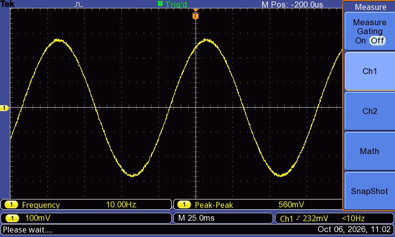</td>
    <td width="50%">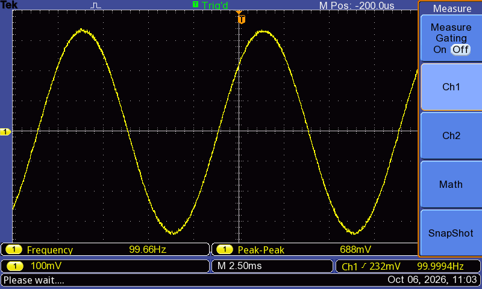</td>
  </tr>
  <tr>
    <td align="center">Seno de 10 Hz</td>
    <td align="center">Seno de 100 Hz</td>
  </tr>
  <tr>
    <td>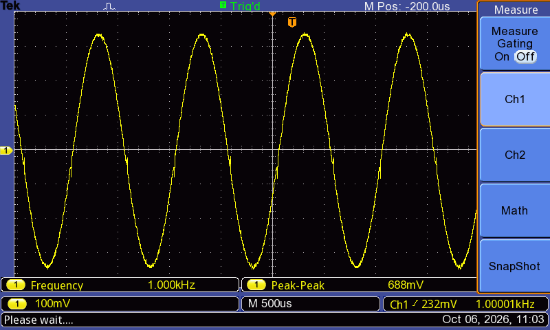</td>
    <td>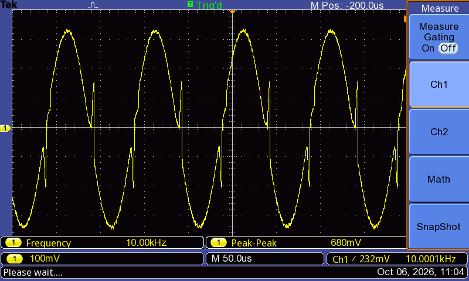</td>
  </tr>
  <tr>
    <td align="center">Seno de 1 kHz</td>
    <td align="center">Seno de 10 kHz: distorção nos cruzamentos por zero</td>
  </tr>
  <tr>
    <td>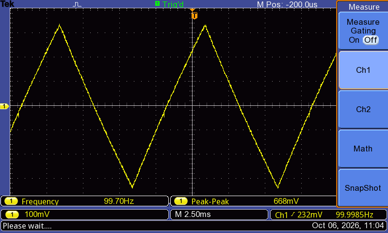</td>
    <td>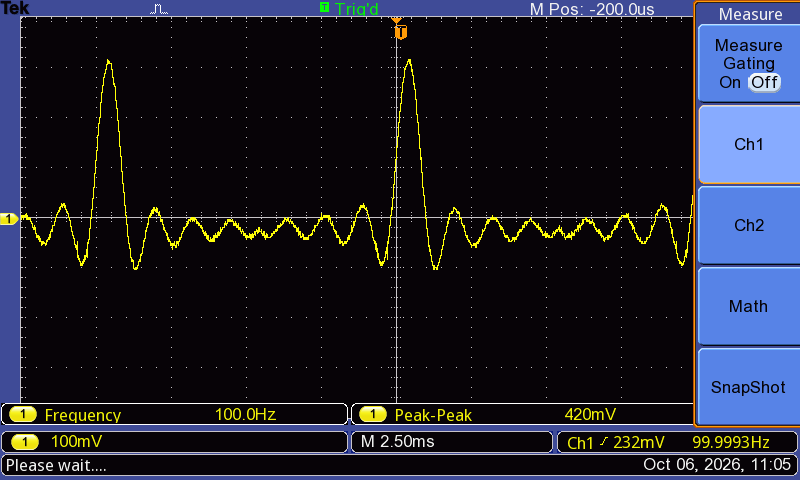</td>
  </tr>
  <tr>
    <td align="center">Rampa de 100 Hz</td>
    <td align="center">Sinc de 100 Hz</td>
  </tr>
  <tr>
    <td>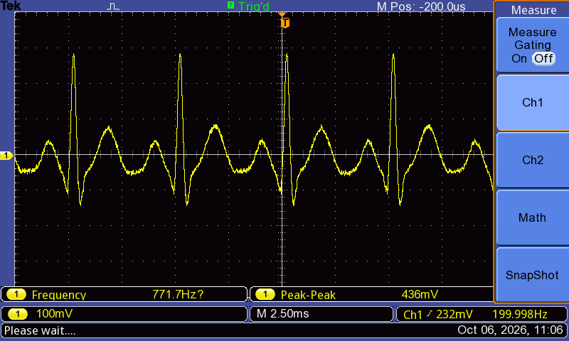</td>
    <td>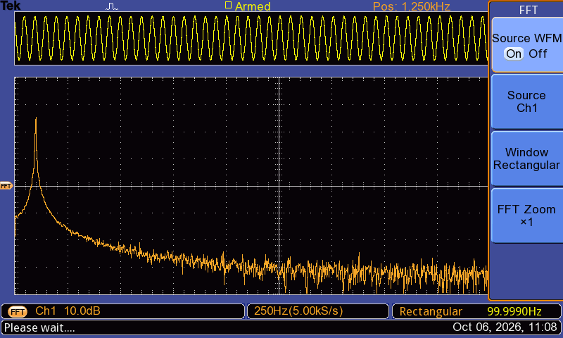</td>
  </tr>
  <tr>
    <td align="center">Forma arbitrária (ECG), 100 Hz: o contador mede 200 Hz (dois batimentos por período)</td>
    <td align="center">FFT do seno de 100 Hz, até 2,5 kHz</td>
  </tr>
  <tr>
    <td>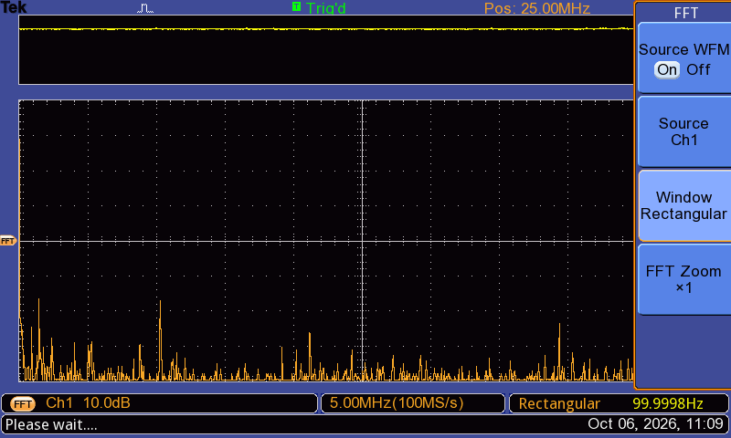</td>
    <td>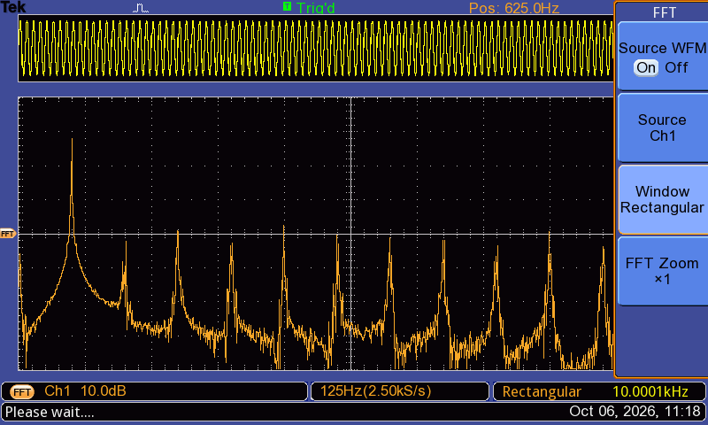</td>
  </tr>
  <tr>
    <td align="center">FFT do seno de 100 Hz, até 50 MHz</td>
    <td align="center">FFT do seno de 10 kHz a 2,5 kS/s: aliasing do osciloscópio</td>
  </tr>
</table>

### Saída do subtrator (`subtrator/`)

<table>
  <tr>
    <td width="50%">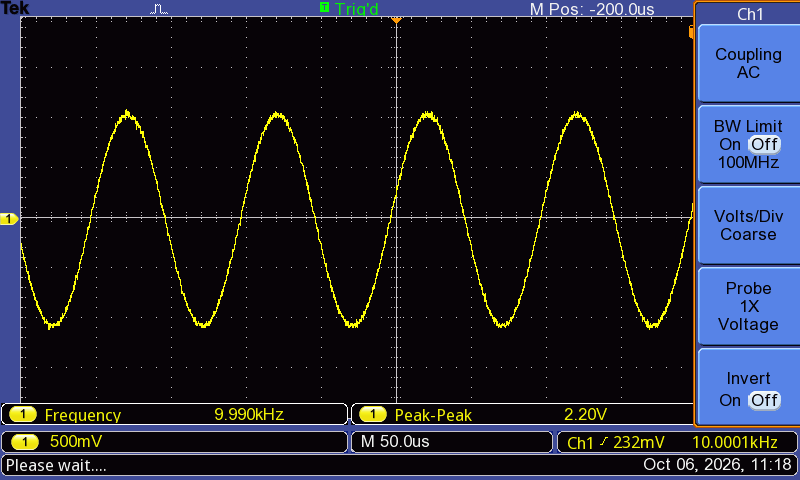</td>
    <td width="50%"></td>
  </tr>
  <tr>
    <td align="center">Seno de 10 kHz: limpo, ao contrário da saída</td>
    <td align="center">Seno de 20 kHz</td>
  </tr>
  <tr>
    <td>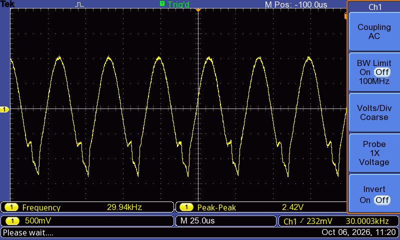</td>
    <td></td>
  </tr>
  <tr>
    <td align="center">Seno de 30 kHz: distorção perto do vale</td>
    <td></td>
  </tr>
</table>

## Teste dos pesos dos bits

Nos primeiros ensaios, o seno tinha um serrilhado que crescia com a frequência, e o código
antigo mostrava o mesmo efeito. Para achar a causa, foram usadas duas tabelas de teste em
[`fpga/lut/`](../../fpga/lut), carregadas na memória arbitrária pela GUI (**Arbitrária** →
**Abrir arquivo...** → **Enviar ao FPGA**):

| Tabela | Conteúdo |
|---|---|
| `teste_bits_1a4.txt` | 4 trechos; cada um alterna só um bit (1, 2, 3 e 4) em torno do código 128 |
| `teste_bits_todos.txt` | 8 trechos, um por bit (0 a 7); o do bit 7 alterna 64 ↔ 192 e serve de marcador |

Com um DAC correto, cada pulso tem o dobro da altura do anterior. O pulso do bit 2 não apareceu.
Com o DAC fora do soquete, a linha desse bit (JP5 pino 5, GPIO[4] → J1 pino 3 → DAC0800 pino 10)
não tinha nível lógico: estava aberta no cabo. Depois do conserto, as capturas acima não mostram
sinal do defeito. Agrupando o desvio pelo resto do código por 8, a diferença entre bit 2 = 1 e
bit 2 = 0 fica abaixo de 0,1 LSB, contra os 4 LSB que o defeito produziria.
