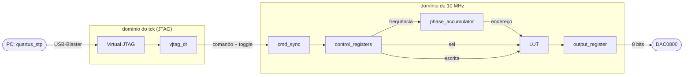
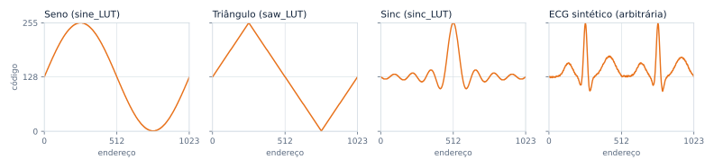
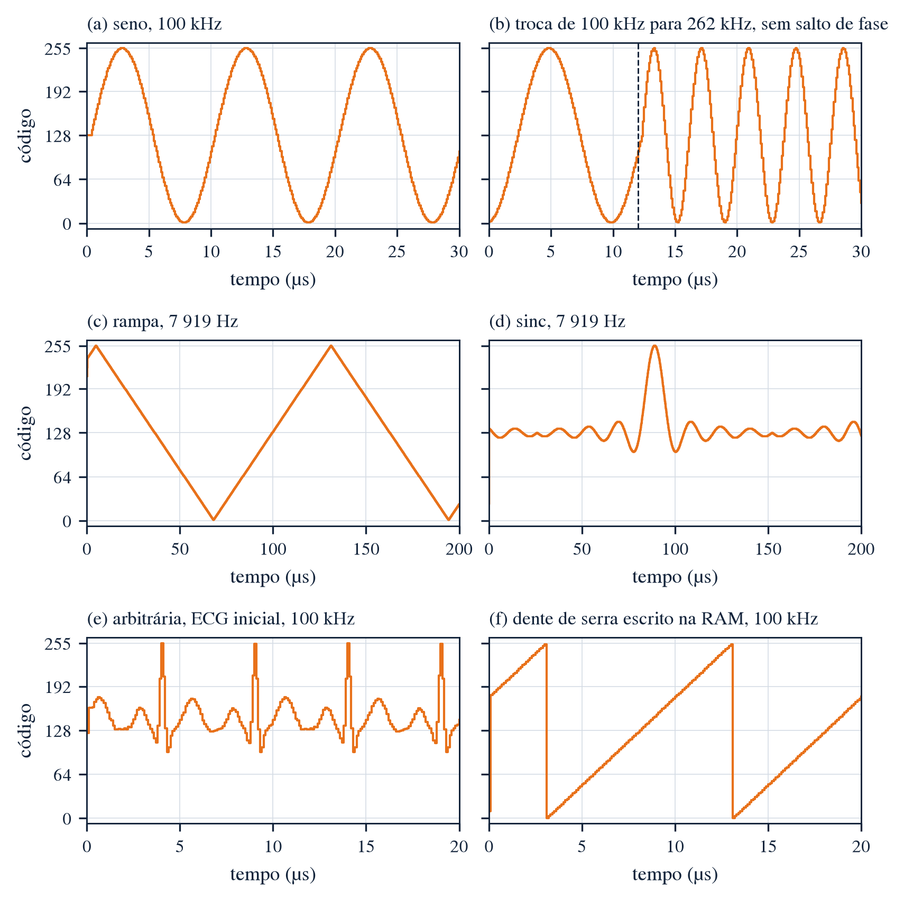
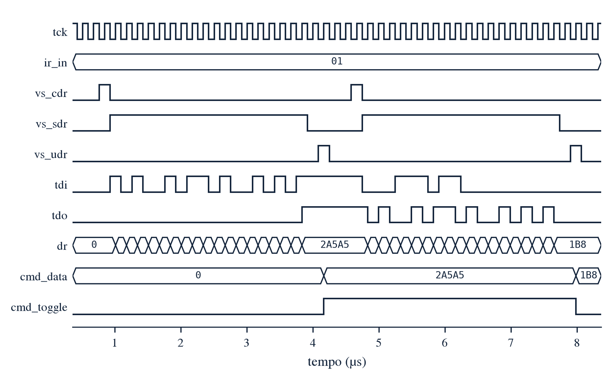
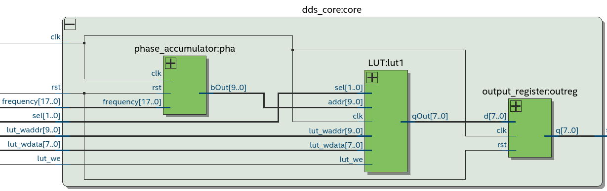
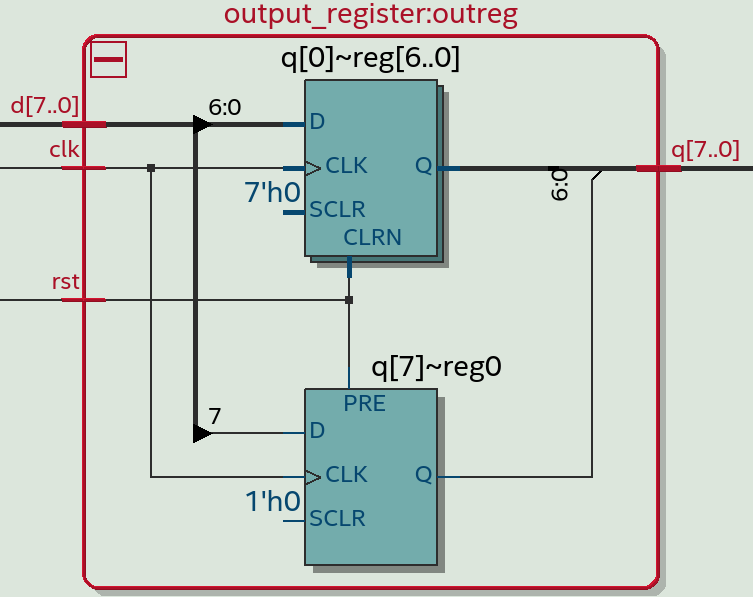

# Parte digital: o DDS no FPGA

[← Voltar ao início](../README.md) · [Parte analógica](../analog/README.md) · [Interface (GUI)](../GUI/README.md) · [Roda de fase (jogo)](https://nseic.github.io/dds_waveform_generator/jogo/)

Núcleo do gerador, em VHDL: acumulador de fase de 32 bits, quatro memórias de forma de onda,
registrador de saída para o DAC e o controle pelo PC via Virtual JTAG. Roda na
**Terasic DE2-115** (Intel Cyclone IV E EP4CE115F29C7) e entrega a cada clock um código de
8 bits para o DAC da [placa analógica](../analog/README.md).

Ferramentas: Quartus Prime 18.1 Lite (síntese) e GHDL (simulação).

## Arquitetura

Cada função fica numa entidade própria, e o top-level só liga os blocos aos pinos da placa.
As constantes (larguras, protocolo do JTAG, códigos das formas) ficam num pacote único,
`dds_pkg`.

```
DDS (top-level: pinos da DE2-115)
├── PLL                     50 MHz → 10 MHz (IP ALTPLL)
├── reset_sync              KEY[0] e PLL destravado → reset liberado em sincronia com os 10 MHz
├── jtag_interface          controle pelo PC
│   ├── jtag                Virtual JTAG (IP do Platform Designer)
│   └── jtag_control        lógica do controle, testável sem a IP
│       ├── vjtag_dr            registrador DR e bypass, no domínio do tck
│       ├── cmd_sync            travessia tck → 10 MHz (toggle sincronizado em 3 flip-flops)
│       └── control_registers   frequência, forma de onda e escrita na LUT
├── dds_core                núcleo do DDS, todo em 10 MHz
│   ├── phase_accumulator
│   │   ├── frequency_translator   Hz → FTW, multiplicação em ponto fixo
│   │   ├── word_adder             FTW + fase
│   │   ├── phase_register         registrador de fase de 32 bits
│   │   └── truncator              10 bits mais significativos da fase
│   ├── LUT
│   │   ├── sine_LUT, saw_LUT, sinc_LUT   ROMs 1024 × 8
│   │   ├── arbitrary_LUT                 RAM 1024 × 8 de duas portas
│   │   └── out_mux                       seleção da forma
│   └── output_register     amostra registrada para o DAC
└── dac_clock               clock do DAC no GPIO[1], com a borda no meio da amostra
```



O acumulador de fase soma a palavra de sintonia (FTW, ou M) a cada clock. O estouro natural
do registrador de 32 bits é a volta de 2π. Os 10 bits mais significativos da fase endereçam
a LUT, que converte fase em amplitude. Da fase até o pino do DAC são 3 clocks: 2 das memórias
(endereço e saída registrados) e 1 do registrador de saída.

> [!TIP]
> Para ver isso funcionando em câmera lenta, abra a **[roda de fase](https://nseic.github.io/dds_waveform_generator/jogo/)**:
> é o mesmo acumulador, reduzido a 8 bits, com a LUT ao lado e o desafio *descubra o M*.

## Parâmetros

| Grandeza | Valor |
|---|---|
| Clock do DDS (f<sub>clk</sub>) | 10 MHz (PLL a partir dos 50 MHz da placa) |
| Acumulador de fase (N) | 32 bits |
| Resolução de frequência Δf = f<sub>clk</sub> / 2³² | ≈ 2,33 mHz |
| Endereço da LUT (P) | 10 bits, 1024 amostras por período |
| Largura da amostra (D) | 8 bits, offset binary (zero do sinal = código 128) |
| Entrada de frequência | 18 bits, inteiro em Hz (0 a 262 143 Hz) |
| Conversão Hz → FTW | `M = (f × 7 205 759 404) >> 24` (ponto fixo Q24) |
| Depois do reset | seno de 1 kHz, sem precisar do PC |
| Limite de Nyquist | 5 MHz (na prática, bem abaixo, conforme o DAC e o filtro) |

Relações principais:

$$
f_{out} = \frac{M \cdot f_{clk}}{2^{N}} \qquad
\Delta f = \frac{f_{clk}}{2^{N}} \qquad
\text{SFDR}_{\text{truncamento de fase}} \approx 6{,}02 \cdot P \ \text{dB} \approx 60\ \text{dB}
$$

A quantização da amostra em 8 bits limita a relação sinal-ruído a cerca de
6,02 · 8 + 1,76 ≈ 50 dB.

## Arquivos

| Arquivo | Função |
|---|---|
| `DDS.qpf`, `DDS.qsf`, `DDS.sdc` | Projeto Quartus, pinagem e restrições de tempo |
| `dds_pkg.vhd` | Constantes: larguras, Hz → FTW, instruções do JTAG, códigos das formas, zero do DAC |
| `DDS.vhd` | Top-level: PLL, reset, controle pelo PC e núcleo, ligados aos pinos |
| `reset_sync.vhd` | Entra em reset na hora e sai sincronizado com o clock (3 flip-flops) |
| `jtag_interface.vhd` | IP do Virtual JTAG + `jtag_control` |
| `jtag_control.vhd` | `vjtag_dr` + `cmd_sync` + `control_registers`, sem a IP |
| `vjtag_dr.vhd` | DR de 18 bits (LSB primeiro), bypass no IR 00, comando no Update-DR |
| `cmd_sync.vhd` | Passa o comando do tck para os 10 MHz (toggle + dado parado) |
| `control_registers.vhd` | Decodifica o comando: frequência, `sel` e pulso de escrita na LUT |
| `dds_core.vhd` | Acumulador de fase + LUT + registrador de saída |
| `phase_accumulator.vhd` | Junta conversor de frequência, somador, registrador de fase e truncador |
| `frequency_translator.vhd` | Converte frequência em Hz na FTW de 32 bits (multiplicação em ponto fixo) |
| `word_adder.vhd` | Somador de 32 bits: FTW + fase atual |
| `phase_register.vhd` | Registrador de fase de 32 bits, com reset assíncrono |
| `truncator.vhd` | Seleciona os 10 bits mais significativos da fase (31..22) |
| `LUT.vhd` | As quatro memórias e o multiplexador de saída |
| `out_mux.vhd` | Seleciona a forma: `00` seno, `01` rampa, `10` sinc, `11` arbitrária |
| `output_register.vhd` | Amostra registrada para o DAC; no reset, código 128 (0 V) |
| `dac_clock.vhd` | Clock de 10 MHz no pino do DAC, por um registrador DDR (`altddio_out`) |
| `sine_LUT`, `saw_LUT`, `sinc_LUT` (`.vhd/.qip/.cmp`) | ROMs 1024 × 8 (`altsyncram`), inicializadas pelos `.mif` |
| `arbitrary_LUT` (`.vhd/.qip/.cmp`) | RAM 1024 × 8 de duas portas: escrita pelo PC, leitura pela fase; começa com o ECG |
| `PLL` (`.vhd/.qip/.cmp/.ppf`) | ALTPLL: 50 MHz → 10 MHz |
| `jtag.qsys`, `jtag/` | Virtual JTAG (Platform Designer), IR de 2 bits |
| `lut/` | Tabelas `.mif` das formas de onda ([abaixo](#formas-de-onda-lut)) |
| `testbenches/` | Um testbench por bloco, o script que roda todos, as figuras e as visões RTL do Quartus ([Testbenches](#testbenches)) |

<details>
<summary><b>Como a frequência vira FTW sem divisor</b> (<code>frequency_translator</code>)</summary>

<br>

A palavra de sintonia exata seria `M = f · 2³² / f_clk`, o que pede uma divisão. Como f<sub>clk</sub>
é fixo, a divisão vira multiplicação por uma constante em ponto fixo com 24 bits fracionários:

```
K = round(2^56 / f_clk) = 7 205 759 404 = 0x1_AD7F_29AC   (33 bits)
P = f · K                                                  (18 + 33 = 51 bits)
M = P >> 24                                                (32 bits)
```

Para todas as entradas de 0 a 262 143 Hz o erro de `M` é menor que 1 LSB (o maior é
0,99986 LSB, em 2 752 Hz), ou seja, o erro de frequência fica abaixo de Δf ≈ 2,33 mHz. O
`tb_frequency_translator` confere as 2¹⁸ entradas. A GUI usa a mesma conta para mostrar a FTW.

</details>

<details>
<summary><b>Por que só 10 bits endereçam a LUT</b> (<code>truncator</code>)</summary>

<br>

Uma LUT com 2³² posições seria impossível. O truncador descarta os 22 bits de baixo da fase e
usa `fase(31..22)` como endereço: são 1024 amostras por período. O custo é um erro de fase
periódico, que aparece no espectro como espúrios a cerca de 6,02 · P ≈ 60 dB abaixo da
portadora. Na roda de fase dá para ver o efeito: o ponteiro anda, mas o endereço só muda
quando ele cruza a fronteira de um setor.

</details>

## Formas de onda (`lut/`)

Todas têm 1024 amostras de 8 bits em offset binary, com o zero do sinal no código 128.

<picture>
  <source media="(prefers-color-scheme: dark)" srcset="../docs/img/luts-dark.svg">
  
</picture>

| Arquivo | Conteúdo | Uso |
|---|---|---|
| `sine_1024x8.mif` | `round(128 + 127·sin(2πk/1024))` | ROM `sine_LUT` |
| `triangle_1024x8.mif` | Rampa de subida e descida, em fase com o seno | ROM `saw_LUT` |
| `sinc_1024x8.mif` | `round(128 + 127·sinc((k−512)/64))`, janela x ∈ [−8, 8) | ROM `sinc_LUT` |
| `ecg_1024x8.mif` | ECG sintético estocástico (modelo ECGSYN) | Conteúdo inicial da RAM `arbitrary_LUT` |

<details>
<summary><b>ECG sintético</b></summary>

<br>

Gerado com o modelo dinâmico **ECGSYN** (McSharry et al., 2003), distribuído pelo PhysioNet:
três EDOs acopladas com as ondas P, Q, R, S e T como gaussianas na fase, intervalos RR
estocásticos com espectro bimodal (ondas de Mayer a 0,1 Hz e arritmia sinusal respiratória
a 0,25 Hz, razão LF/HF = 0,5) e ruído de medida. Parâmetros: 120 bpm médios, desvio de
3 bpm, ruído de 0,015 mV, semente 2026.

A tabela contém **2 batimentos por período** (RR de 0,502 s e 0,496 s), recortados no segmento
TP para emendar sem descontinuidade. Assim, com **f = 1 Hz** no DDS, a saída é um ECG de
**120 bpm**. Escala: ≈ 8,8 µV por código (R ≈ 1,1 mV).

</details>

## Controle pelo PC (Virtual JTAG)

| IR | Instrução | DR (18 bits) |
|---|---|---|
| `00` | nenhuma (bypass de 1 bit) | — |
| `01` | frequência | f em Hz |
| `10` | forma de onda | `sel` nos 2 bits de baixo |
| `11` | escrita na LUT arbitrária | `endereço(9..0) & dado(7..0)` |

O PC usa o `quartus_stp` (`device_virtual_ir_shift` / `device_virtual_dr_shift`); a
[GUI](../GUI/README.md) faz isso por trás. No FPGA, o caminho tem três blocos:

1. **`vjtag_dr`** (domínio do tck): desloca o DR LSB primeiro durante o Shift-DR. No Update-DR,
   guarda instrução e valor e troca o nível de `cmd_toggle`. No Capture-DR, carrega o último
   valor escrito com a mesma instrução, para depuração por leitura.
2. **`cmd_sync`**: sincroniza o toggle em 3 flip-flops no domínio de 10 MHz e copia o comando
   quando ele muda. O comando fica parado até o próximo Update-DR, que leva mais de 22 ciclos de
   tck (3,7 µs a 6 MHz); a travessia leva 0,4 µs.
3. **`control_registers`**: aplica o comando. A escrita na LUT é um pulso de 1 clock na porta de
   escrita da RAM, que é separada da porta de leitura: a forma arbitrária continua saindo
   enquanto a LUT é reescrita.

O LED verde `LEDG[1]` muda de estado a cada comando aceito, e `LEDG[0]` acende com o PLL
travado.

## Pinos da DE2-115

| Porta | Pino | Sinal na placa | Padrão |
|---|---|---|---|
| `clk_50` | PIN_Y2 | CLOCK_50 | 3,3-V LVTTL |
| `rst_n` | PIN_M23 | KEY[0] (apertado = reset) | 3,3-V LVTTL |
| `dac[0]` … `dac[7]` | PIN_AB21, Y17, AC21, Y16, AD21, AE16, AD15, AE15 | GPIO[2] … GPIO[9] (LSB … MSB), para J1 da placa analógica | 3,3-V LVTTL |
| `dac_clk` | PIN_AC15 | GPIO[1], clock de 10 MHz do DAC | 3,3-V LVTTL |
| `dac_gnd` | PIN_AB22 | GPIO[0] em '0', referência de terra no cabo | 3,3-V LVTTL |
| `led_locked` | PIN_E21 | LEDG[0] | 2,5 V |
| `led_cmd` | PIN_E22 | LEDG[1] | 2,5 V |

A pinagem é a mesma da versão usada na bancada (TCCV1 do projeto anterior), inclusive os padrões
de I/O, então o cabo atual serve. Os 8 bits saem de registradores de I/O
(`FAST_OUTPUT_REGISTER`) e mudam juntos, na borda de subida do clock de 10 MHz.

O `dac_clk` é o clock de 10 MHz invertido, gerado por um registrador DDR de saída: a borda de
subida dele cai 50 ns depois da mudança dos bits, no meio da amostra. O DAC0800 não usa clock;
o pino fica para um DAC com registrador de entrada e serve de gatilho para o osciloscópio. Os
switches `SW[4..0]` do código legado não entram: a forma e a frequência vêm do PC.

## Síntese

Compilação completa no Quartus 18.1 Lite (outubro de 2026):

| Recurso | Uso |
|---|---|
| Elementos lógicos | 378 de 114 480 (< 1 %) |
| Registradores | 264 |
| Bits de memória | 32 768 (as 4 memórias de 1024 × 8) |
| Multiplicadores de 9 bits | 4 (a conversão Hz → FTW) |
| PLL | 1 de 4 |
| Pinos | 14 |

| Clock | Fmax (85 °C) | Folga de setup | Folga de hold |
|---|---|---|---|
| 10 MHz (PLL) | 100,28 MHz | 90,0 ns | 0,32 ns |
| tck do JTAG | 29,49 MHz | 33,0 ns | 0,40 ns |

O tck do USB-Blaster vai até 6 MHz, bem abaixo dos 29,49 MHz.

Nenhum caminho fica sem restrição. Os avisos que restam são esperados: portas internas da IP do
Virtual JTAG sem uso, `dac_gnd` fixo em terra e a nota sobre interfaces de 3,3 V do Cyclone IV.

## Compilar e gravar

1. Abra `fpga/DDS.qpf` no Quartus 18.1 e compile (*Processing → Start Compilation*).
   Se a pasta `fpga/jtag/` for apagada, regenere o Virtual JTAG abrindo `fpga/jtag.qsys`
   no Platform Designer (*Generate HDL*, VHDL).
2. Grave o `.sof` (`fpga/output_files/DDS.sof`) pelo Programmer (USB-Blaster, chave
   RUN/PROG da placa em **RUN**).
3. A saída começa num seno de 1 kHz. Feche o Programmer antes de abrir a
   [GUI](../GUI/README.md): os dois disputam o cabo.

## Testbenches

A pasta `testbenches/` tem um testbench auto-verificável por bloco, do menor ao top-level.
Cada um compara o circuito com um modelo de referência e termina com `<nome>: OK`.

| Testbench | O que confere |
|---|---|
| `tb_frequency_translator` | As 2¹⁸ entradas: FTW = `(f·K) >> 24` e erro menor que 1 LSB do valor exato |
| `tb_word_adder` | Soma de 32 bits com estouro, casos de borda e 10 000 pares aleatórios |
| `tb_phase_register` | Carga só na borda de subida e reset assíncrono |
| `tb_truncator` | Endereço = fase(31..22) |
| `tb_phase_accumulator` | Endereço clock a clock contra o modelo, trocas de frequência sem salto de fase, 0 Hz |
| `tb_out_mux` | Cada código de `sel` |
| `tb_LUT` | Os 1024 endereços das 3 ROMs e da RAM contra os `.mif`, escrita na RAM durante a leitura |
| `tb_output_register` | Código 128 no reset e carga na borda |
| `tb_dds_core` | Cada amostra contra o modelo do DDS: 4 formas, trocas com o DDS rodando, escrita na RAM |
| `tb_reset_sync` | Entrada em reset imediata e saída na 3ª borda |
| `tb_vjtag_dr` | DR LSB primeiro, comando no Update-DR, leitura no Capture-DR, bypass |
| `tb_cmd_sync` | 300 comandos de um clock de 6 MHz para 10 MHz: todos chegam, uma vez, na ordem |
| `tb_control_registers` | Valores depois do reset, decodificação, pulso de escrita e IR 00 ignorado |
| `tb_jtag_control` | Do DR do JTAG até os registradores, com 64 escritas na LUT |
| `tb_system` | Do comando do PC até a amostra do DAC, incluindo o envio de uma LUT inteira |
| `tb_DDS` | Top-level com PLL: 10 MHz, clock do DAC, LEDs, seno de 1 kHz nos pinos e reset pelo botão |

Nos testbenches, o modelo da IP do Virtual JTAG é substituído por procedimentos que geram os
mesmos sinais (tck, IR, Capture/Shift/Update-DR), em `tb_utils_pkg.vhd`.

```bash
sudo apt install ghdl                                    # uma vez
fpga/testbenches/run_all.sh                              # todos (~2,5 min; o tb_DDS leva 1 min)
fpga/testbenches/run_all.sh tb_dds_core tb_system        # só alguns
WAVES=1 fpga/testbenches/run_all.sh tb_dds_core          # grava testbenches/waves/tb_dds_core.ghw (GTKWave)
```

Na primeira execução o script compila a biblioteca `altera_mf` do Quartus em
`testbenches/work/` (o Quartus é procurado em `~/intelFPGA_lite/18.1/quartus` ou em
`QUARTUS_ROOTDIR`). O ModelSim-Altera 18.1 para Linux é 32-bit e precisa das bibliotecas i386
do sistema; por isso a simulação foi montada no GHDL.

### Figuras

`testbenches/gerar_figuras.py` roda os testbenches gravando só os sinais de interesse e desenha
as figuras em [`testbenches/figuras/`](testbenches/figuras/), em PNG (300 dpi) e PDF
(vetorial), na largura de 16 cm, sem título (a legenda vai no texto):

```bash
pip install numpy matplotlib
python3 fpga/testbenches/gerar_figuras.py                # todas
python3 fpga/testbenches/gerar_figuras.py --sem-simular  # só redesenha
```

<table>
  <tr>
    <td width="50%"></td>
    <td width="50%"></td>
  </tr>
  <tr>
    <td align="center"><sub><code>tb_dds_core_formas</code>: as quatro formas, troca de frequência sem salto de fase e a RAM reescrita</sub></td>
    <td align="center"><sub><code>tb_vjtag_dr</code>: dois deslocamentos de DR e os comandos gerados no Update-DR</sub></td>
  </tr>
</table>

| Figura | Conteúdo |
|---|---|
| `tb_frequency_translator` | FTW para as 2¹⁸ entradas e o erro de truncamento |
| `tb_word_adder`, `tb_truncator`, `tb_out_mux` | Diagramas de tempo dos casos de borda |
| `tb_phase_register`, `tb_output_register`, `tb_reset_sync` | Diagramas de tempo de carga e reset |
| `tb_phase_accumulator` | Endereço da LUT em 1 kHz e nas trocas de frequência |
| `tb_LUT_tabelas`, `tb_LUT_latencia` | O que cada memória devolve em cada endereço, e a latência de 2 clocks |
| `tb_dds_core_formas`, `tb_dds_core_latencia` | Saída para cada forma, e a latência de 3 clocks depois do reset |
| `tb_vjtag_dr`, `tb_cmd_sync`, `tb_control_registers`, `tb_jtag_control` | O caminho de um comando do JTAG até os registradores |
| `tb_system_visao_geral`, `tb_system_detalhes` | A saída durante a sequência de comandos do PC e a LUT enviada |
| `tb_DDS_pll`, `tb_DDS_saida` | Travamento do PLL e o seno de 1 kHz nos pinos do DAC |

### Visões RTL

[`testbenches/rtl/`](testbenches/rtl/) tem as prints do RTL Viewer do Quartus (*Tools → Netlist
Viewers → RTL Viewer*) de cada entidade testada, para acompanhar as figuras dos testbenches no
TCC. `rtl_virtual_jtag_ip.png` mostra o interior do IP do Virtual JTAG.

<table>
  <tr>
    <td width="50%"></td>
    <td width="50%"></td>
  </tr>
  <tr>
    <td align="center"><sub><code>dds_core</code>: acumulador de fase, tabelas e registrador de saída</sub></td>
    <td align="center"><sub><code>output_register</code>: o reset em 0x80 vira clear nos bits 0 a 6 e preset no bit 7</sub></td>
  </tr>
</table>

## Estado atual

- [x] Acumulador de fase de 32 bits com conversão Hz → FTW em ponto fixo
- [x] PLL de 10 MHz e reset sincronizado
- [x] ROMs de seno, rampa e sinc, RAM arbitrária de duas portas e multiplexador de saída
- [x] Controle pelo Virtual JTAG: DR, travessia de domínio de clock e registradores
- [x] Pinagem da DE2-115 e restrições de tempo, com timing fechado no Quartus
- [x] 16 testbenches passando no GHDL, com figuras
- [ ] Validação na placa: controle pela GUI, medidas de frequência e espectro

<details>
<summary><b>Histórico de mudanças</b></summary>

<br>

**Controle pelo PC e encapsulamento (outubro de 2026)**

- Bloco de registradores do JTAG (`vjtag_dr`, `cmd_sync`, `control_registers`), agrupado em
  `jtag_control` e `jtag_interface`; frequência, forma e LUT deixaram de ser portas do top-level.
- `arbitrary_LUT` virou RAM de duas portas (escrita pelo PC, leitura pela fase), começando com o
  ECG; antes a RAM era escrita no endereço da fase.
- `dds_core` reúne acumulador, LUT e o novo `output_register`; `reset_sync` sincroniza o reset.
- `phase_register` passou a atualizar na borda de subida, como o resto do caminho de dados.
- `dds_pkg` concentra as constantes; os blocos usam instanciação direta de entidades (a IP do
  Virtual JTAG, que fica na biblioteca `jtag`, é instanciada como componente).
- Pinos (os mesmos da versão de bancada), `DDS.sdc` e registradores de I/O para o DAC.
- `fpga/sim/` virou `fpga/testbenches/`, com um testbench por bloco e as figuras.

**Correções de ligação (outubro de 2026)**, confirmadas na síntese e na simulação

- `truncator`: o endereço da LUT passou a ser `fase(31..22)`; antes eram os 10 bits menos
  significativos da fase.
- `phase_accumulator`: a realimentação do somador agora é a saída do `phase_register`; antes a
  entrada `feedback` não tinha fonte e o acumulador não acumulava.
- `LUT`: `sinc_LUT` ligada em `qsinc` (havia dois drivers em `qsaw`) e `out_mux` com mapeamento
  nomeado; antes `qsinc` ficava de fora e a saída `qout` sem conexão.
- `DDS`: o PLL recebe a porta `clk` (antes um sinal sem fonte); o acumulador de fase roda em
  `clk10MHz`, como a LUT e o cálculo da FTW.
- Na síntese, o Quartus removia as memórias e o PLL (0 bits de memória); depois da correção
  ficaram as 4 memórias de 1024 × 8 e o PLL.

</details>
