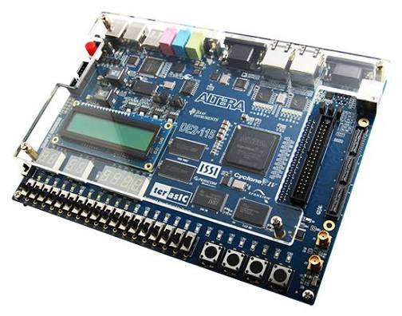
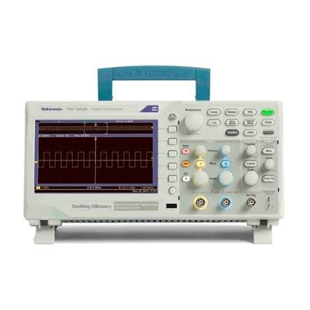
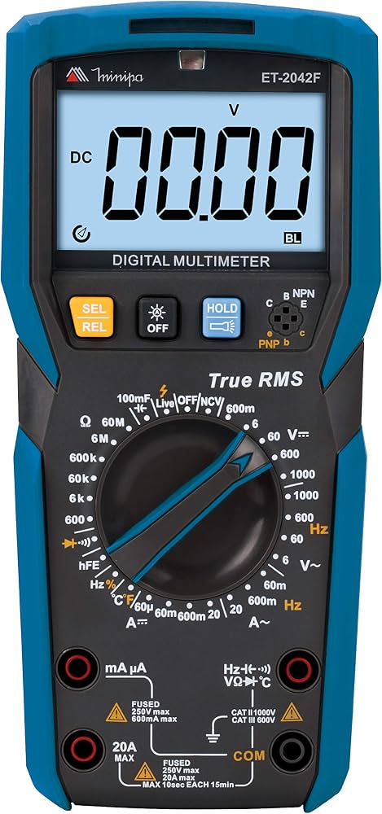
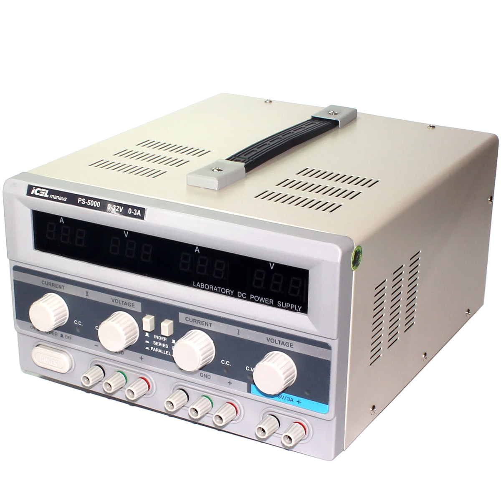

# Instrumentos utilizados

[← Voltar ao início](../README.md) · [Softwares utilizados](../softwares/README.md) · [Resultados de bancada](../analog/resultados/README.md)

Equipamentos usados no desenvolvimento do gerador e nos ensaios em bancada. As imagens são de
divulgação dos fabricantes.

<table>
  <tr>
    <td width="30%" align="center"></td>
    <td>
      <b>Terasic DE2-115</b> 
      Placa de desenvolvimento com o FPGA Intel Cyclone IV E EP4CE115F29C7. 
      Recebe o projeto digital. Dela vêm o oscilador de 50 MHz, o botão KEY[0] (reset), os
      LEDs de estado, o conector de expansão JP5 (GPIO) ligado ao DAC e o USB-Blaster embutido,
      usado para gravar o FPGA e para o controle pelo Virtual JTAG
      (<a href="../fpga/README.md">parte digital</a>).
    </td>
  </tr>
  <tr>
    <td align="center"></td>
    <td>
      <b>Tektronix TBS1102B</b> 
      Osciloscópio digital de 2 canais, 100 MHz e 2 GS/s. 
      Usado em todas as medidas de bancada: formas de onda, contador de frequência e FFT.
      As telas e os pontos de cada medida, salvos em PNG, CSV e SET, estão em
      <a href="../analog/resultados/README.md">analog/resultados</a>.
    </td>
  </tr>
  <tr>
    <td align="center"></td>
    <td>
      <b>Minipa ET-2042F</b> 
      Multímetro digital True RMS. 
      Conferência das tensões de alimentação da placa analógica e da continuidade das
      linhas do barramento do DAC, no diagnóstico do bit 2
      (<a href="../analog/resultados/README.md#teste-dos-pesos-dos-bits">teste dos pesos dos bits</a>).
    </td>
  </tr>
  <tr>
    <td align="center"></td>
    <td>
      <b>ICEL Manaus PS-5000</b> 
      Fonte de alimentação de bancada de dois canais, 0 a 32 V e 0 a 3 A. 
      Alimentação da placa analógica (<a href="../analog/README.md">parte analógica</a>).
    </td>
  </tr>
  <tr>
    <td align="center"></td>
    <td>
      <b>SanDisk Cruzer Blade, 16 GB</b> 
      Pendrive USB. 
      Guardou as telas e os dados salvos pelo osciloscópio. Parte das capturas foi
      recuperada com o <code>fsck.vfat</code> depois de o pendrive ser retirado durante uma
      gravação (<a href="../analog/resultados/README.md">detalhes</a>).
    </td>
  </tr>
</table>
