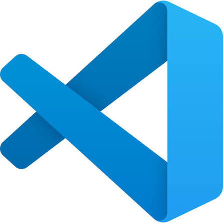

# Softwares utilizados

[← Voltar ao início](../README.md) · [Instrumentos utilizados](../instruments/README.md)

Programas usados no projeto, do FPGA à placa analógica e ao texto do TCC. As imagens são de
divulgação dos fabricantes.

<table>
  <tr>
    <td width="25%" align="center"></td>
    <td>
      <b>Intel Quartus Prime Lite 18.1</b> 
      Ambiente de projeto para FPGAs da Intel. 
      Síntese, posicionamento e roteamento, análise de tempo (TimeQuest), RTL Viewer,
      Platform Designer (IP do Virtual JTAG) e Programmer. O <code>quartus_stp</code> faz a ponte
      entre a <a href="../GUI/README.md">interface</a> e o USB-Blaster
      (<a href="../fpga/README.md">parte digital</a>).
    </td>
  </tr>
  <tr>
    <td align="center"></td>
    <td>
      <b>LTspice 26</b> (Analog Devices) 
      Simulador SPICE, usado no Linux pelo Wine. 
      Simulação da placa analógica com o modelo comportamental do DAC0800
      (<a href="../analog/simulation">analog/simulation</a> e
      <a href="../analog/modelos/DAC0800/README.md">analog/modelos/DAC0800</a>).
    </td>
  </tr>
  <tr>
    <td align="center"></td>
    <td>
      <b>Altium Designer</b> 
      Ferramenta de projeto de placas de circuito impresso. 
      Esquemático e layout da placa analógica
      (<a href="../analog/layout">analog/layout</a>).
    </td>
  </tr>
  <tr>
    <td align="center"></td>
    <td>
      <b>Visual Studio Code</b> (Microsoft) 
      Editor de código. 
      Edição do código VHDL, dos scripts e da interface em Python, dos READMEs e do texto
      do TCC.
    </td>
  </tr>
  <tr>
    <td align="center"></td>
    <td>
      <b>Claude</b> (Anthropic), pelo Claude Code 
      Assistente de inteligência artificial. 
      Apoio, sob a orientação e a revisão do autor, na escrita do código VHDL e dos
      testbenches, dos scripts e da interface em Python, da documentação e do texto do TCC, e
      na análise das medidas de bancada.
    </td>
  </tr>
</table>

## Outros programas

| Programa | Uso |
|---|---|
| GHDL 5.0.1 | Simulação dos 16 testbenches do projeto digital ([testbenches](../fpga/README.md#testbenches)) |
| Python 3.12, com Tkinter, NumPy, Matplotlib e PyInstaller | Interface gráfica, executável da interface e scripts das figuras |
| LaTeX (TeX Live e Overleaf) | Texto do TCC, no modelo da COELE-CM da UTFPR ([overleaf](../overleaf)) |
| KiCad | Visualização do projeto da placa importado do Altium, para as imagens do esquemático, do layout e da vista 3D |
| ModelSim-Altera | Simulação do [código legado](../fpga/legado/README.md) |
| Git e GitHub | Controle de versões e publicação do repositório |
